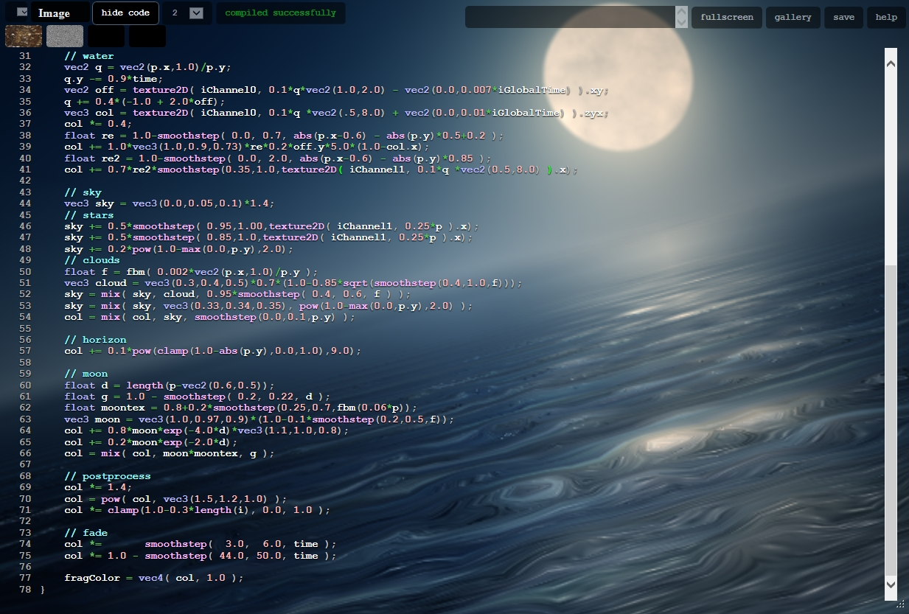
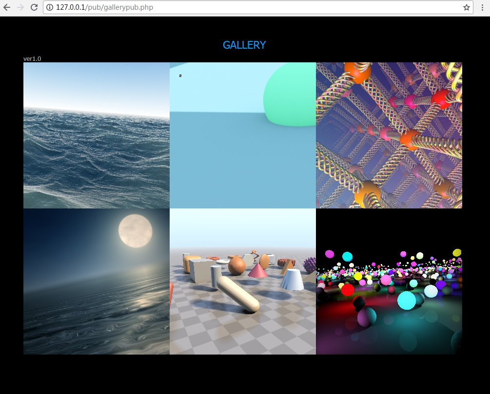

this is a offline shadertoy revised version for myself, i implemented a glsl sandbox looking for orginal shadertoy, makes me feel much cool when creating shader stuffs.  you can push that php based web project to your own web server. 

the new glsl sandbox looking as showed below, additionally i added a gallery page as a place to show your all saved outstanding vfx's and etc..

demo site here http://46.101.40.231  shader code is hided by defualt, tricky method to show code editor is concating &sh=0 to site address region like http://46.101.40.231/indexpub.php?id=20190124~153133.png&sh=0.

gallery page

